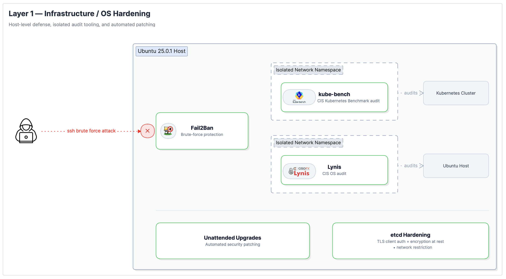
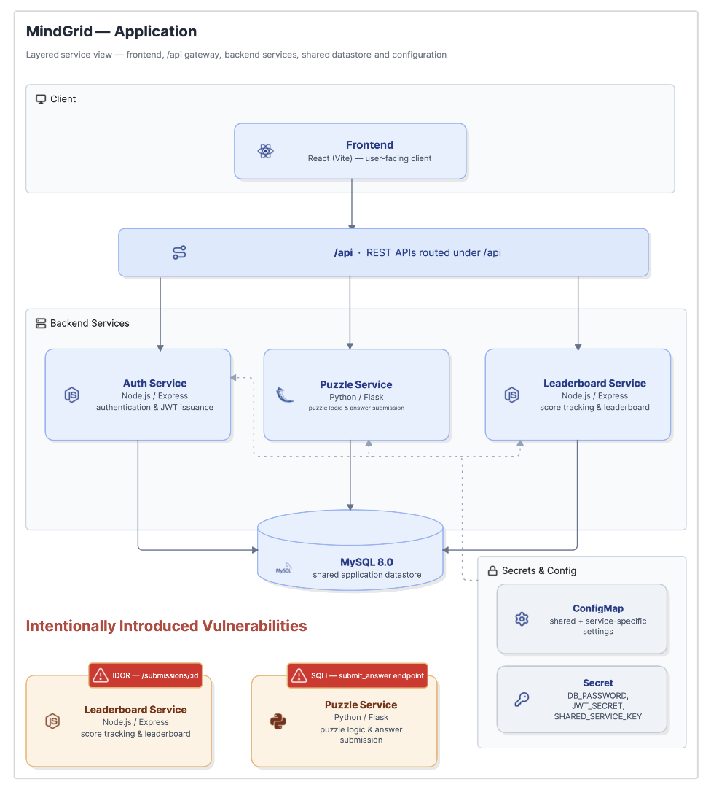
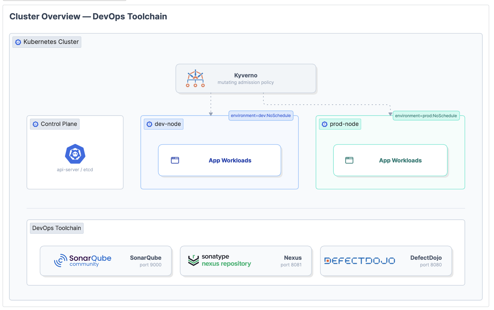
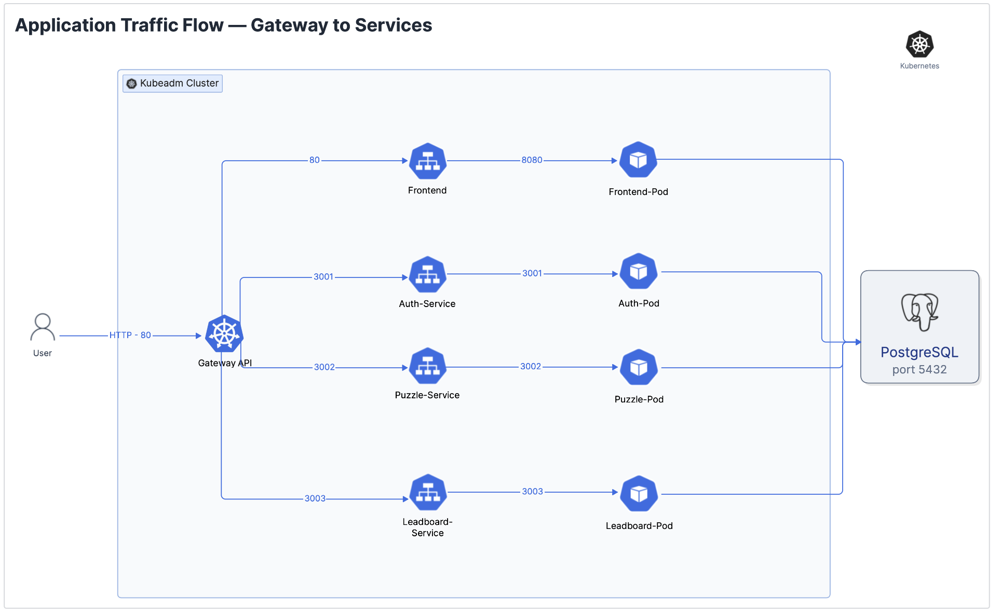
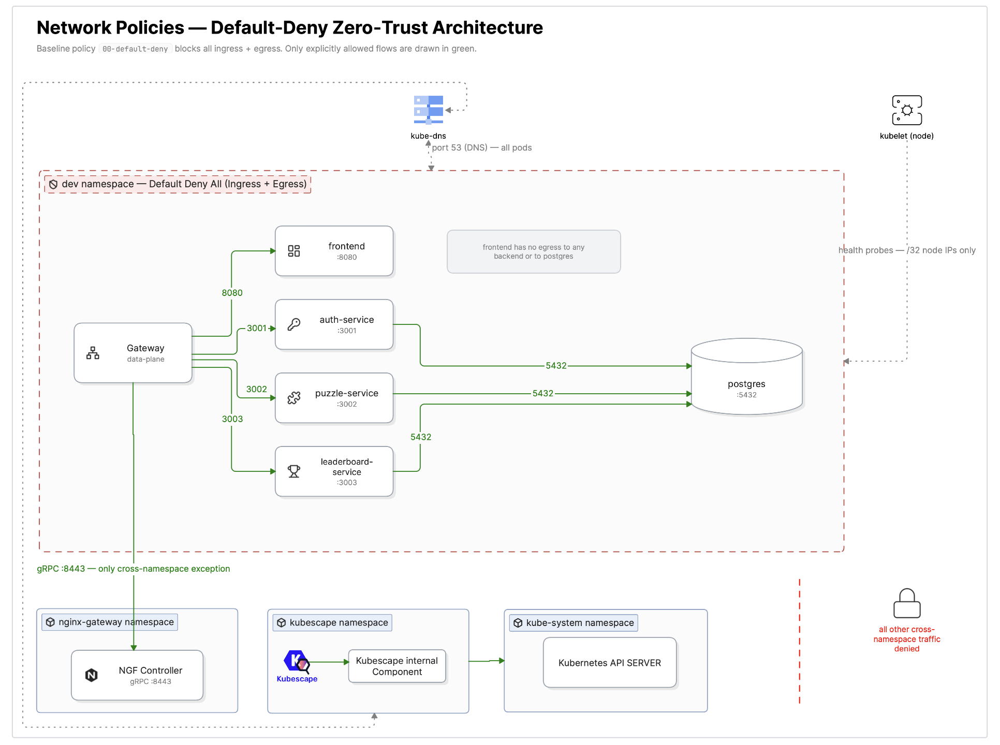
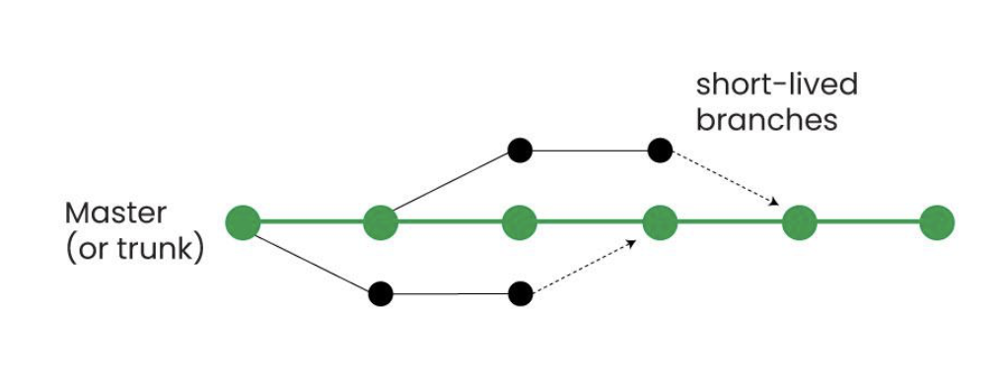
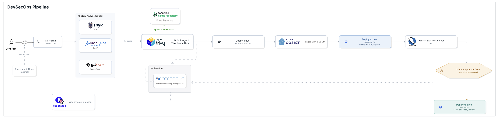

# MindGrid: Defense-in-Depth DevSecOps Platform

> [!IMPORTANT]
> **Complete Technical Report Available**  
> For an in-depth, academic-grade breakdown of the threat modeling, mathematical/empirical validations, configuration details, and security architecture rationale, please consult the full PDF report:  
> 📄 **[MindGrid Project Report.pdf](./MindGrid%20Project%20Report.pdf)**

---

## 📌 Executive Summary & Motivation

**MindGrid** is an end-to-end, multi-layer **Defense-in-Depth DevSecOps** implementation designed to secure a modern cloud-native microservices application. 

The architecture is directly inspired by the **March 2026 Trivy supply-chain attack**, where attackers exploited GitHub Actions token leakage and mutable Git version tag reassignments (`@v0.35.0`) to inject silent data-exfiltration payloads into CI/CD pipelines while keeping builds appearing green.

Rather than treating security as an afterthought or relying on isolated point solutions, MindGrid implements a comprehensive defense system aligned with **OWASP guidelines** and **CIS Benchmarks** across three independent layers:
1. **Layer 1: Infrastructure & OS Hardening** (Host security, kernel/network namespace isolation for auditing tools, Fail2Ban, unattended upgrades, and etcd zero-exposure).
2. **Layer 2: Application Workload Security** (Pod security standards, non-root execution, read-only root filesystems, Kyverno admission control, zero-trust NetworkPolicies, and Gateway API rate limiting).
3. **Layer 3: CI/CD & Supply Chain Security** (Trunk-based development, branch protection, keyless image signing via Cosign, Syft SBOM attestation, parallel SAST/SCA/Secret scanning, authenticated DAST via OWASP ZAP, and centralized triage in DefectDojo).

---

## 🛡️ The 3-Layer Defense-in-Depth Architecture

```
+-------------------------------------------------------------------------+
| Layer 3: CI/CD & Software Supply Chain Security                         |
| (Gitleaks, SonarQube, Snyk, Trivy, Cosign, Syft SBOM, ZAP, DefectDojo)  |
+-------------------------------------------------------------------------+
                                    |
                                    v
+-------------------------------------------------------------------------+
| Layer 2: Application Workload & Kubernetes Security                     |
| (Gateway API, Kyverno, Default-Deny NetworkPolicy, Non-Root, Kubescape) |
+-------------------------------------------------------------------------+
                                    |
                                    v
+-------------------------------------------------------------------------+
| Layer 1: Infrastructure & Host OS Hardening                             |
| (CIS Benchmark, Lynis/kube-bench Sandboxing, Fail2Ban, etcd Hardening) |
+-------------------------------------------------------------------------+
```

---

## 🖥️ Layer 1: Infrastructure & OS Hardening

Layer 1 establishes a hardened host operating system (Ubuntu) and Kubernetes control plane foundation.



### Key Controls & Implementation Details

1. **Sandboxed Security Auditing (Lynis & kube-bench)**:
   - *Problem*: Auditing tools run as `root` to inspect the OS/Kubernetes state. If poisoned via a supply-chain attack, they could exfiltrate host data and secrets.
   - *Defense*: 
     - Binaries are pinned to exact versions and verified using **GPG signatures** (`install-lynis.sh`).
     - An initial integrity baseline hash tree is generated (`sha256sum`) to detect post-install file tampering.
     - Scanners execute inside an **isolated Linux network namespace** (`ip netns add lynis-ns`) with zero network interfaces, routing tables, or DNS. Even with `root` privileges, a compromised auditor has no network devices to reach out to.
   - *Scan Results*: 256 tests performed (network-dependent tests intentionally skipped due to namespace isolation), 4 warnings reviewed and remediated.

2. **Automated Host Protection**:
   - **Fail2Ban**: Monitors SSH and authentication logs to dynamically ban IPs exhibiting repeated failed authentication attempts, blocking automated brute-force attacks at the firewall.
   - **Unattended Upgrades**: Configured on Ubuntu to automatically apply upstream security patches nightly.

3. **Control Plane & etcd Hardening (CIS Kubernetes Benchmark)**:
   - Audited with `kube-bench` (78 checks PASS).
   - Enforced **TLS client certificate authentication** on etcd (`curl -k` rejects unauthenticated calls with `SSL routines::tlsv13 alert certificate required`).
   - Enabled **Kubernetes Secret encryption at rest** via `EncryptionConfiguration`.
   - **Network-Level Access Restriction**: Applied host `iptables` firewall rules restricting port `2379` traffic exclusively to the control-plane host IP (`192.168.1.27`), preventing unauthorized LAN probing.

---

## 🧩 Layer 2: Application Workload Security

### Application Overview (MindGrid)

MindGrid is structured as four containerized microservices interacting with a stateful PostgreSQL database.



| Service | Stack | Port | Purpose |
| :--- | :--- | :--- | :--- |
| **Frontend** | React 19 (Vite) / `nginx-unprivileged` | `8080` (mapped to `:80`) | Web client UI |
| **Auth Service** | Node.js / Express | `3001` | JWT issuance & user management |
| **Puzzle Service** | Python / Flask | `3002` | Game logic & answer validation |
| **Leaderboard Service** | Node.js / Express | `3003` | Score tracking & statistics |
| **Database** | PostgreSQL 15 | `5432` | Dedicated relational datastore |

---

### Cluster Topology & Automated Environment Isolation

The cluster is split into dedicated nodes for environment separation (`control-plane`, `dev-node`, `prod-node`).



- **Node Tainting**: Worker nodes are tainted with `environment=dev:NoSchedule` and `environment=prod:NoSchedule`.
- **Kyverno Mutating Policy (`auto-node-routing.yaml`)**: Automatically injects matching tolerations based on the target namespace (`dev` vs. `prod`), eliminating manual configuration errors.
- **Controller Tolerations (`kyverno-values.yaml`)**: Explicitly configured for Kyverno's own controllers to ensure scheduling outside application namespace boundaries.

---

### Gateway API & Traffic Routing

MindGrid adopts the modern **Kubernetes Gateway API** (`gateway.networking.k8s.io/v1`) implemented via **NGINX Gateway Fabric** rather than legacy Ingress.



- **Prefix Path Routing**:
  - `/api/auth` $\rightarrow$ `auth-service:3001`
  - `/api/puzzle` $\rightarrow$ `puzzle-service:3002`
  - `/api/leaderboard` $\rightarrow$ `leaderboard-service:3003`
  - `/` (catch-all) $\rightarrow$ `frontend:80`
- **Gateway-Level Rate Limiting**: A dedicated `RateLimitPolicy` attached to `/api/auth/login` limits login attempts to **5 req/s (burst 10)** per client IP, returning HTTP `429 Too Many Requests` on brute-force attempts before traffic ever hits the Auth service.

---

### Standardized Pod Security Baseline

Every application workload enforces a uniform, hardened `securityContext` conforming to the **Pod Security Standards (Restricted)** profile:

- **Non-Root Execution**: `runAsNonRoot: true` with non-zero UIDs (backends: `10001`, nginx: `101`, postgres: `1234`).
- **Read-Only Root Filesystem**: `readOnlyRootFilesystem: true` prevents runtime file tampering. Ephemeral `emptyDir` volumes are explicitly mounted only for required paths (`/tmp`, `/var/cache/nginx`, `/.gunicorn`).
- **Full Capability Dropping**: `capabilities.drop: ["ALL"]` with `allowPrivilegeEscalation: false`.
- **Seccomp Profile**: `seccompProfile.type: RuntimeDefault` restricts syscalls.
- **Immutable Digest Pinning**: All container images are referenced strictly by SHA-256 digest (`image@sha256:...`), preventing mutable tag overwrites.
- **ServiceAccount Hardening**: `automountServiceAccountToken: false` on all application service accounts, verified to hold 0 Kubernetes API permissions.
- **Health Probes**: Liveness and readiness probes configured across all workloads (`/health` HTTP endpoints for backends, `pg_isready` for Postgres).

---

### Zero-Trust Network Policies

A strict **Default-Deny** model is enforced across ingress and egress traffic.



#### 📊 Connectivity Matrix

| Source $\rightarrow$ Destination | Frontend | Auth Service | Puzzle Service | Leaderboard | PostgreSQL | NGF Controller |
| :--- | :---: | :---: | :---: | :---: | :---: | :---: |
| **Gateway Data-Plane** | ✅ `:8080` | ✅ `:3001` | ✅ `:3002` | ✅ `:3003` | ❌ Denied | ✅ `:8443` |
| **Frontend** | — | ❌ Denied | ❌ Denied | ❌ Denied | ❌ Denied | ❌ Denied |
| **Auth Service** | ❌ Denied | — | ❌ Denied | ❌ Denied | ✅ `:5432` | ❌ Denied |
| **Puzzle Service** | ❌ Denied | ❌ Denied | — | ❌ Denied | ✅ `:5432` | ❌ Denied |
| **Leaderboard Service** | ❌ Denied | ❌ Denied | ❌ Denied | — | ✅ `:5432` | ❌ Denied |
| **PostgreSQL** | ❌ Denied | ❌ Denied | ❌ Denied | ❌ Denied | — | ❌ Denied |
| **Node Kubelet IPs** | ✅ Probes | ✅ Probes | ✅ Probes | ✅ Probes | ✅ Probes | — |
| **CoreDNS (`:53`)** | ✅ Allow | ✅ Allow | ✅ Allow | ✅ Allow | ✅ Allow | — |

*Key Security Benefit*: The frontend pod cannot directly reach the backends or the database; all traffic must pass through the Gateway's routing and rate-limiting controls. Backend services cannot communicate with each other except through explicitly defined channels.

---

### Kubescape Runtime Compliance & Egress Lockdown

- **Threat Analysis**: Kubescape requires broad cluster read permissions to audit configurations and secrets. To prevent secret exfiltration in the event of a scanner compromise, an **egress NetworkPolicy** confines Kubescape traffic strictly to the internal Kubernetes API server and local node kubelet.
- **Compliance Scores Achieved**:
  - **MITRE ATT&CK**: `85.89%`
  - **NSA/CISA Kubernetes Hardening**: `88.30%`

---

## 🚀 Layer 3: CI/CD & Software Supply Chain Security

### Branching Strategy & Governance



- **Trunk-Based Development (TBD)**: Short-lived feature branches (`feature/*`) merge directly into `main`.
- **Strict Branch Protection Rules**:
  - Direct pushes to `main` blocked.
  - Pull requests require code owner reviews and conversation resolution.
  - Required CI status checks (SAST, SCA, Secret scanning, container scans, image signing) must pass before merge.
  - Stale approvals dismissed on push; bypass prevention enforced for repository administrators.

---

### 🔄 The DevSecOps Pipeline Flow

The GitHub Actions workflow (`.github/workflows/DevSecOps_Pipeline.yml`) enforces automated security gates at every phase:



```
[ Developer Commit ]
         │ (Talisman Pre-commit Hook)
         ▼
[ Pull Request to main ]
         │
         ├──► [ Stage 1: Parallel Static Analysis ]
         │         ├── Gitleaks (Git History Secret Scanning) ──► DefectDojo
         │         ├── SonarQube (SAST & Code Quality Gate)
         │         └── Snyk (SCA Dependency Vulnerabilities)
         │
         ▼ (Gate Passed)
[ Stage 2: Container Build & Image Security ]
         │
         ├── Nexus Repository (Proxy for pip/npm dependencies)
         └── Trivy Container Image Scan (HIGH/CRITICAL blocker) ──► DefectDojo
         │
         ▼
[ Stage 3 & 4: Push, Keyless Sign & SBOM ]
         │
         ├── Docker Hub Push (Digest extracted)
         ├── Cosign Keyless Signing (Sigstore/Rekor transparency log via GitHub OIDC)
         └── Syft CycloneDX SBOM Generation & Cryptographic Attestation
         │
         ▼
[ Stage 5: Deploy to Dev & Rollout Verification ]
         │
         ├── Deploy via Dev-Scoped GitHub Deployer RBAC ServiceAccount
         └── Health Gate: readyReplicas == desiredReplicas
         │
         ▼
[ Stage 6: DAST Penetration Testing ]
         │
         └── OWASP ZAP Active Attack Simulation (Port-forwarded dev endpoint) ──► DefectDojo
         │
         ▼
[ Stage 7: Production Promotion ]
         │
         ├── Required Manual Approval Gate (GitHub Environment)
         └── Deploy to Prod via Prod-Scoped RBAC ServiceAccount
```

---

### Key Security Highlights of the Pipeline

1. **Fail-Fast Ordering**: Secret scanning, SAST, and SCA run concurrently in Stage 1. If any vulnerability or leaked secret is found, the pipeline fails immediately before container builds start.
2. **Keyless Signing with Cosign & OIDC**: Images are signed keylessly using GitHub Actions OIDC identity tokens recorded on the public Rekor transparency log. No long-lived private signing keys exist to be stolen.
3. **Cryptographically Attested SBOMs**: Syft generates a CycloneDX Software Bill of Materials for each service, signed and attached to the image digest via Cosign.
4. **Nexus Dependency Proxy**: Build steps route npm and pip package resolution through an internal Sonatype Nexus proxy, shielding builds from upstream outages and registry tampering.
5. **Least-Privilege Deployer RBAC**: The CI pipeline authenticates to the cluster using dedicated namespace-scoped `Role` / `RoleBinding` identities (`github-deployer`), completely preventing dev tokens from interacting with the prod namespace.
6. **Centralized Triage with DefectDojo**: Findings from Gitleaks, Trivy, Kubescape, and OWASP ZAP are aggregated automatically via REST API into DefectDojo for centralized deduplication and tracking.

---

## 🎯 Intentionally Introduced Test Vulnerabilities

To validate that security scanners and admission policies detect real-world flaws rather than only synthetic tests, two vulnerabilities were deliberately introduced into the application:

1. **SQL Injection (CWE-89) in Puzzle Service**:
   - *Location*: `puzzle-service/app.py` (`submit_answer` endpoint).
   - *Mechanism*: Direct string concatenation in SQL queries without parameterization.
   - *Validation*: Detected by SAST (SonarQube) and authenticated DAST (OWASP ZAP).

2. **Insecure Direct Object Reference / IDOR (CWE-284) in Leaderboard Service**:
   - *Location*: `leaderboard-service/server.js` (`/submissions/:id` endpoint).
   - *Mechanism*: Endpoint verifies JWT validity but fails to check record ownership against the authenticated user ID.
   - *Validation*: Used to refine the OWASP ZAP scanning strategy—demonstrated that **authenticated DAST scans** are essential to reach and exercise endpoints protected behind login sessions.

---

## 📂 Repository Structure

```
├── .github/
│   └── workflows/
│       └── DevSecOps_Pipeline.yml   # Complete 8-stage CI/CD pipeline
├── MindGrid Project Report.pdf      # Complete 42-page technical design report
├── OWASP-ZAP/                       # OWASP ZAP automation & authentication configs
├── auth-service/                    # Node.js Express authentication microservice
├── db/                              # Database schemas and seed data
├── frontend/                        # React (Vite) + nginx-unprivileged client
├── k8s/                             # Kubernetes manifests
│   ├── Gateway API/                 # NGINX Gateway Fabric & RateLimitPolicy
│   ├── github-deployer/             # CI/CD RBAC service accounts & roles
│   ├── k8-auth-service/             # Auth service deployment & service
│   ├── k8-frontend/                 # Frontend deployment & service
│   ├── k8-leadboard-service/        # Leaderboard deployment & service
│   ├── k8-puzzle-service/           # Puzzle deployment & service
│   ├── kyverno/                     # Kyverno admission & mutation policies
│   ├── network-policies/            # Default-deny & zero-trust network policies
│   ├── secrets/                     # Secret and ConfigMap manifests
│   ├── serviceaccount/              # Hardened ServiceAccount definitions
│   └── storage/                     # PostgreSQL StatefulSet & StorageClass
├── kubescape/                       # Kubescape compliance scan configurations
├── leaderboard-service/             # Node.js Express leaderboard microservice
├── lynis/                           # Lynis hardening, GPG verification & cron scripts
├── puzzle-service/                  # Python Flask puzzle microservice
├── screenshots/                     # Architecture and pipeline diagrams
├── SECRETS.md                       # Secret templates and guidelines
├── VULNERABILITIES.md               # Details on intentional test vulnerabilities
└── docker-compose.yml               # Local development stack
```

---

## 💻 Local Development Quickstart

### Prerequisites
- Docker & Docker Compose
- Node.js (v18+) & npm
- Python (v3.11+)

### Running Locally with Docker Compose

```bash
# 1. Clone the repository
git clone https://github.com/yassine0010/DevSecOps-Hardening-Platform.git
cd DevSecOps-Hardening-Platform

# 2. Configure local environment variables
cp .env.example .env

# 3. Start database and local services
docker compose up -d
```

### Running on Kubernetes (kubeadm / Minikube / K3s)

```bash
# 1. Apply storage, secrets, and configurations
kubectl apply -f k8s/storage/
kubectl apply -f k8s/secrets/
kubectl apply -f k8s/serviceaccount/

# 2. Apply Kyverno security policies
kubectl apply -f k8s/kyverno/

# 3. Apply Zero-Trust Network Policies
kubectl apply -f k8s/network-policies/

# 4. Deploy workloads & Gateway routing
kubectl apply -f k8s/k8-auth-service/
kubectl apply -f k8s/k8-puzzle-service/
kubectl apply -f k8s/k8-leadboard-service/
kubectl apply -f k8s/k8-frontend/
kubectl apply -f k8s/Gateway\ API/
```

---

## 🔮 Scope Boundaries & Future Work

The following enhancements are documented as planned extensions:
- **Runtime Threat Detection with Falco**: Real-time kernel eBPF / syscall monitoring to detect anomalous container execution behavior.
- **Centralized Audit Logging**: Aggregating Kubernetes audit logs and container logs into an ELK or Grafana Loki stack for cross-layer event correlation.
- **Distributed Tracing & Observability**: OpenTelemetry instrumentation across microservices for distributed tracing and anomaly detection.

---

## 👤 Author

- **Yassine Ben Ayed** — *DevSecOps Design & Implementation*
